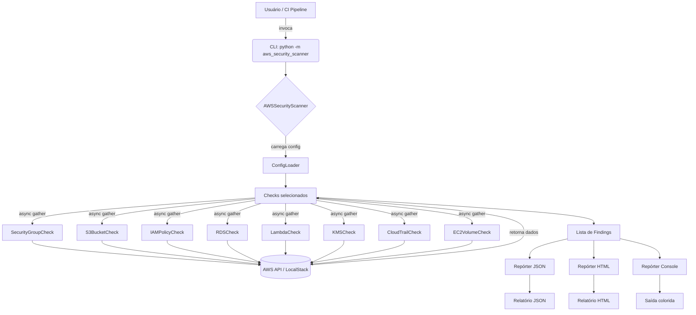
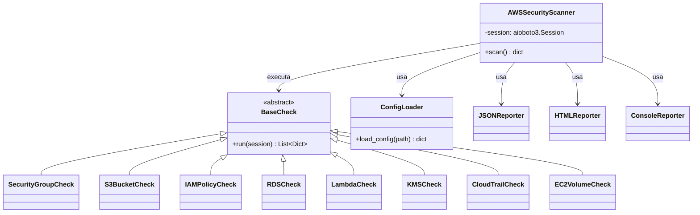
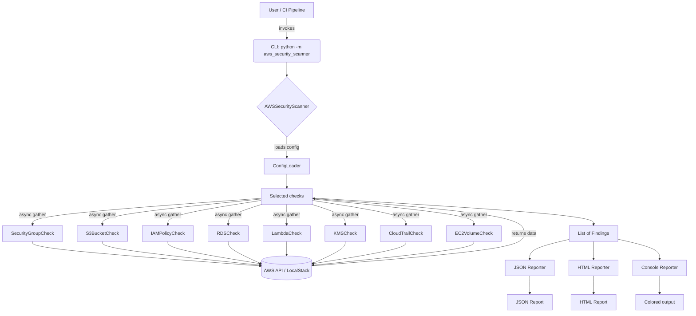
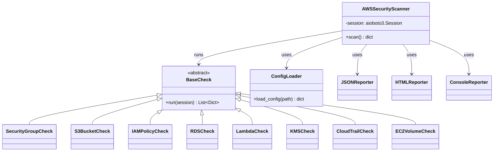

Perfeito! O README está bem completo, porém notei **um conflito de merge no final** que precisa ser corrigido. As linhas `<<<<<<< HEAD`, `=======`, e `>>>>>>> 3a45818...` não devem ficar no arquivo.

Além disso, como você expandiu o projeto com novos checks, Docker e CI/CD (conforme discutimos), faz sentido atualizar o README para refletir essas mudanças. Abaixo está a **versão final revisada**, sem conflito e com as novas informações incorporadas.

---

## 🔧 Como corrigir o conflito agora

No seu terminal (dentro da pasta do projeto), abra o `README.md` e remova as linhas de conflito. Basicamente, delete estas três linhas no final:

```
<<<<<<< HEAD
---
=======
---
>>>>>>> 3a45818 (feat: initial commit - AWS Security Scanner)
```

Deixe apenas:

```
---
```

Depois faça:

```bash
git add README.md
git commit -m "fix: resolve README merge conflict"
```

Se preferir, substitua todo o conteúdo pelo README abaixo.

---

## ✅ README final atualizado (sem conflito e com novos módulos)

```markdown
<p align="center">
  
  
  
  
  
  
  
  
  
</p>

<h1 align="center">🔐 aws-security-scanner</h1>
<p align="center">Ferramenta CLI assíncrona para identificar configurações de segurança incorretas na AWS.<br>
<em>Asynchronous CLI tool to identify misconfigured security settings in AWS.</em></p>

---

## 📚 Sumário | Table of Contents

- [Português](#português)
  - [📖 Sobre o Projeto](#-sobre-o-projeto)
  - [🧰 Funcionalidades](#-funcionalidades)
  - [🧱 Arquitetura e Diagramas](#-arquitetura-e-diagramas)
  - [🚀 Como Começar](#-como-começar)
  - [🧪 Testes](#-testes)
  - [📊 Relatórios](#-relatórios)
  - [📂 Estrutura do Projeto](#-estrutura-do-projeto)
  - [🤝 Contribuindo](#-contribuindo)
  - [📄 Licença](#-licença)
- [English](#english)
  - [📖 About the Project](#-about-the-project)
  - [🧰 Features](#-features)
  - [🧱 Architecture & Diagrams](#-architecture--diagrams)
  - [🚀 Getting Started](#-getting-started)
  - [🧪 Testing](#-testing)
  - [📊 Reports](#-reports)
  - [📂 Project Structure](#-project-structure)
  - [🤝 Contributing](#-contributing)
  - [📄 License](#-license)

---

# Português

## 📖 Sobre o Projeto

O **aws-security-scanner** é uma ferramenta de linha de comando (CLI) desenvolvida em Python que escaneia automaticamente sua conta AWS (ou uma simulação local com [LocalStack](https://localstack.cloud/)) em busca de configurações de segurança inadequadas e arriscadas.

Ele verifica atualmente:

- **Security Groups** com portas abertas para o mundo (`0.0.0.0/0`), como SSH (22) e RDP (3389).
- **Buckets S3** com acesso público indevido.
- **Políticas IAM** excessivamente permissivas (ex.: `"Action": "*"`, `"Resource": "*"`).
- **RDS** instâncias públicas ou sem criptografia em repouso.
- **Lambda** variáveis de ambiente sensíveis e function URLs sem autenticação.
- **KMS** chaves sem rotação automática.
- **CloudTrail** trilhas de auditoria não habilitadas.
- **Volumes EC2** sem criptografia.

Ao final, gera relatórios em **JSON**, **HTML** e **console** com todas as não-conformidades encontradas, pronto para auditorias ou integração em pipelines de CI/CD.

## 🧰 Funcionalidades

- ✅ Escaneamento concorrente com `asyncio` e `aioboto3` – performance mesmo em contas grandes.
- ✅ Checks modulares: Security Groups, S3, IAM, RDS, Lambda, KMS, CloudTrail e EC2.
- ✅ Relatórios detalhados em JSON, HTML (Jinja2) e console colorido.
- ✅ Suporte a ambientes reais AWS e ao simulador LocalStack.
- ✅ Configuração flexível via arquivo YAML e `.env`.
- ✅ Testes unitários com `pytest` e `moto` (mock completo da AWS).
- ✅ Testes de integração com LocalStack via Docker.
- ✅ Cobertura de código >80%.
- ✅ Pipeline de CI/CD com GitHub Actions.
- ✅ Empacotamento como imagem Docker.

## 🧱 Arquitetura e Diagramas

### Diagrama de Fluxo da Execução



### Diagrama de Classes (simplificado)



## 🚀 Como Começar

### Pré-requisitos

- Python 3.10+
- Docker e Docker Compose (apenas para testes com LocalStack)
- Credenciais AWS configuradas (opcional, apenas para scans reais)

### Instalação

```bash
git clone https://github.com/seu-usuario/aws-security-scanner.git
cd aws-security-scanner
python -m venv venv
source venv/bin/activate      # Linux/macOS
venv\Scripts\activate         # Windows
pip install -r requirements.txt
```

### Configuração

Crie um arquivo `.env` baseado no `.env.example`:

```ini
# Para usar LocalStack (ambiente local)
AWS_ENDPOINT_URL=http://localhost:4566
AWS_DEFAULT_REGION=us-east-1
AWS_ACCESS_KEY_ID=fake
AWS_SECRET_ACCESS_KEY=fake
```

Para escanear uma conta real da AWS, deixe as variáveis comentadas e configure suas credenciais padrão (`~/.aws/credentials` ou variáveis de ambiente `AWS_ACCESS_KEY_ID` e `AWS_SECRET_ACCESS_KEY`).

Além do `.env`, você pode ajustar o arquivo `config.yaml` para ativar/desativar checks e filtrar severidades.

### Executando

```bash
# Scan local com LocalStack (inicie o LocalStack primeiro, veja abaixo)
python -m aws_security_scanner --region us-east-1 --format json

# Formato HTML
python -m aws_security_scanner --region us-east-1 --format html > report.html

# Saída colorida no console
python -m aws_security_scanner --format console
```

#### Usando Docker

```bash
docker build -t aws-security-scanner -f docker/Dockerfile .
docker run --rm -e AWS_ACCESS_KEY_ID=... -e AWS_SECRET_ACCESS_KEY=... aws-security-scanner --format json
```

#### Iniciando LocalStack (para testes locais)

```bash
docker-compose up -d
```

O `docker-compose.yml` já provisiona os serviços EC2, S3, IAM, RDS, Lambda, KMS e CloudTrail na porta 4566.

## 🧪 Testes

O projeto possui dois níveis de testes:

### Testes unitários (com `moto`)

Mockam completamente a AWS, sem necessidade de rede ou contêineres.

```bash
pytest tests/ -v
```

### Testes de integração (com LocalStack)

Exigem o LocalStack rodando (`docker-compose up -d`).

```bash
pytest tests/ --integration -v
```

### Cobertura de código

```bash
pytest --cov=src --cov-report=term-missing --cov-report=html
```

Abra `htmlcov/index.html` no navegador para ver o relatório detalhado.

## 📊 Relatórios

### Exemplo de saída JSON

```json
{
  "scan_date": "2026-08-10T14:30:00",
  "total_risks": 2,
  "findings": [
    {
      "resource_type": "SecurityGroup",
      "resource_id": "sg-0a1b2c3d4e5f",
      "risk": "HIGH",
      "detail": "Port 22 open to world"
    },
    {
      "resource_type": "S3Bucket",
      "resource_id": "meu-bucket-publico",
      "risk": "CRITICAL",
      "detail": "Bucket has public read access"
    }
  ]
}
```

### Relatório HTML

O relatório HTML utiliza um template Jinja2 responsivo, com tabela colorida por nível de risco (CRITICAL, HIGH, MEDIUM) e timestamp da varredura.

*(Exemplo de screenshot – você pode adicionar uma imagem real mais tarde)*  


### Saída no Console

A saída no console utiliza cores para facilitar a leitura: vermelho para CRITICAL, amarelo para HIGH, etc.

## 📂 Estrutura do Projeto

```
aws-security-scanner/
├── .github/
│   └── workflows/
│       └── ci.yml                # CI/CD com testes, lint e cobertura
├── config/
│   ├── default.yaml              # Configuração padrão (checks ativos, severidade)
│   └── schema.yaml               # Schema de validação (opcional)
├── docker/
│   ├── Dockerfile                # Imagem Docker do scanner
│   └── docker-compose.yml        # Scanner + LocalStack + DB (opcional)
├── docs/
│   └── report_sample.png
├── src/
│   ├── __init__.py
│   ├── __main__.py               # Ponto de entrada da CLI
│   ├── scanner.py                # Orquestrador dos checks
│   ├── checks/
│   │   ├── __init__.py
│   │   ├── base.py               # Classe base abstrata
│   │   ├── security_groups.py
│   │   ├── s3_buckets.py
│   │   ├── iam_policies.py
│   │   ├── rds.py                # 🆕
│   │   ├── lambda.py             # 🆕
│   │   ├── kms.py                # 🆕
│   │   ├── cloudtrail.py         # 🆕
│   │   └── ec2_volumes.py        # 🆕
│   ├── reporters/
│   │   ├── __init__.py
│   │   ├── json_reporter.py
│   │   ├── html_reporter.py
│   │   └── console_reporter.py   # 🆕
│   ├── utils/
│   │   ├── __init__.py
│   │   ├── aws_client.py         # Fábrica de clientes boto3
│   │   ├── config_loader.py      # 🆕 Carrega e valida YAML
│   │   └── logger.py             # 🆕 Logging padronizado
│   └── templates/
│       └── report_template.html  # Template Jinja2
├── tests/
│   ├── __init__.py
│   ├── conftest.py               # Fixtures compartilhadas
│   ├── test_security_groups.py
│   ├── test_s3_buckets.py
│   ├── test_iam_policies.py
│   ├── test_rds.py
│   ├── test_lambda.py
│   ├── test_kms.py
│   ├── test_cloudtrail.py
│   └── test_ec2_volumes.py
├── .env.example
├── .gitignore
├── docker-compose.yml            # LocalStack
├── Makefile                      # Comandos úteis
├── pyproject.toml                # Metadados e ferramentas
├── requirements.txt
├── config.yaml                   # Arquivo de configuração principal
└── README.md                     # Este arquivo
```

## 🤝 Contribuindo

Contribuições são muito bem-vindas!  
Por favor, abra uma issue para discutir novas ideias ou envie um pull request.  
Certifique-se de que os testes passam e de que a cobertura se mantém acima de 80%.

```bash
# Rodar todos os testes e verificar estilo
make test
make lint
```

## 📄 Licença

Este projeto está licenciado sob a Licença MIT – veja o arquivo [LICENSE](LICENSE) para detalhes.

---

# English

## 📖 About the Project

**aws-security-scanner** is a command-line tool (CLI) built in Python that automatically scans your AWS account (or a local simulation using [LocalStack](https://localstack.cloud/)) for insecure and risky security configurations.

It currently checks for:

- **Security Groups** with ports open to the world (`0.0.0.0/0`), such as SSH (22) and RDP (3389).
- **S3 Buckets** with inappropriate public access.
- **IAM Policies** that are overly permissive (e.g., `"Action": "*"`, `"Resource": "*"`).
- **RDS** public instances or missing encryption at rest.
- **Lambda** sensitive environment variables and unauthenticated function URLs.
- **KMS** keys without automatic rotation.
- **CloudTrail** audit trails not enabled.
- **EC2 Volumes** without encryption.

At the end, it generates **JSON**, **HTML**, and **console** reports with all non-compliant findings, ready for audits or integration into CI/CD pipelines.

## 🧰 Features

- ✅ Concurrent scanning with `asyncio` and `aioboto3` – high performance even in large accounts.
- ✅ Modular checks: Security Groups, S3, IAM, RDS, Lambda, KMS, CloudTrail, and EC2.
- ✅ Detailed reports in JSON, HTML (Jinja2), and colored console output.
- ✅ Support for real AWS environments and LocalStack simulator.
- ✅ Flexible configuration via YAML and `.env`.
- ✅ Unit tests with `pytest` and `moto` (full AWS mocking).
- ✅ Integration tests with LocalStack via Docker.
- ✅ Code coverage >80%.
- ✅ CI/CD pipeline with GitHub Actions.
- ✅ Packaged as a Docker image.

## 🧱 Architecture & Diagrams

### Execution Flow Diagram



### Simplified Class Diagram



## 🚀 Getting Started

### Prerequisites

- Python 3.10+
- Docker and Docker Compose (only for LocalStack tests)
- AWS credentials configured (optional, for real scans only)

### Installation

```bash
git clone https://github.com/your-user/aws-security-scanner.git
cd aws-security-scanner
python -m venv venv
source venv/bin/activate      # Linux/macOS
venv\Scripts\activate         # Windows
pip install -r requirements.txt
```

### Configuration

Create a `.env` file based on `.env.example`:

```ini
# For LocalStack (local environment)
AWS_ENDPOINT_URL=http://localhost:4566
AWS_DEFAULT_REGION=us-east-1
AWS_ACCESS_KEY_ID=fake
AWS_SECRET_ACCESS_KEY=fake
```

To scan a real AWS account, comment out those variables and set up your default credentials (`~/.aws/credentials` or environment variables `AWS_ACCESS_KEY_ID` and `AWS_SECRET_ACCESS_KEY`).

In addition to `.env`, you can adjust `config.yaml` to enable/disable checks and filter severities.

### Running

```bash
# Local scan with LocalStack (start LocalStack first, see below)
python -m aws_security_scanner --region us-east-1 --format json

# HTML format
python -m aws_security_scanner --region us-east-1 --format html > report.html

# Colored console output
python -m aws_security_scanner --format console
```

#### Using Docker

```bash
docker build -t aws-security-scanner -f docker/Dockerfile .
docker run --rm -e AWS_ACCESS_KEY_ID=... -e AWS_SECRET_ACCESS_KEY=... aws-security-scanner --format json
```

#### Starting LocalStack (for local tests)

```bash
docker-compose up -d
```

The included `docker-compose.yml` provisions EC2, S3, IAM, RDS, Lambda, KMS, and CloudTrail on port 4566.

## 🧪 Testing

The project has two levels of tests:

### Unit tests (with `moto`)

Mock all AWS APIs – no network or containers needed.

```bash
pytest tests/ -v
```

### Integration tests (with LocalStack)

Require LocalStack running (`docker-compose up -d`).

```bash
pytest tests/ --integration -v
```

### Code coverage

```bash
pytest --cov=src --cov-report=term-missing --cov-report=html
```

Open `htmlcov/index.html` in your browser for a detailed report.

## 📊 Reports

### Sample JSON output

```json
{
  "scan_date": "2026-08-10T14:30:00",
  "total_risks": 2,
  "findings": [
    {
      "resource_type": "SecurityGroup",
      "resource_id": "sg-0a1b2c3d4e5f",
      "risk": "HIGH",
      "detail": "Port 22 open to world"
    },
    {
      "resource_type": "S3Bucket",
      "resource_id": "my-public-bucket",
      "risk": "CRITICAL",
      "detail": "Bucket has public read access"
    }
  ]
}
```

### HTML Report

The HTML report uses a responsive Jinja2 template, with a color-coded table by risk level (CRITICAL, HIGH, MEDIUM) and scan timestamp.

*(Screenshot placeholder – you can add a real image later)*  


### Console Output

Console output uses colors for readability: red for CRITICAL, yellow for HIGH, etc.

## 📂 Project Structure

```
aws-security-scanner/
├── .github/
│   └── workflows/
│       └── ci.yml                # CI/CD with tests, lint, and coverage
├── config/
│   ├── default.yaml              # Default config (active checks, severity)
│   └── schema.yaml               # Validation schema (optional)
├── docker/
│   ├── Dockerfile                # Docker image
│   └── docker-compose.yml        # Scanner + LocalStack + DB (optional)
├── docs/
│   └── report_sample.png
├── src/
│   ├── __init__.py
│   ├── __main__.py               # CLI entry point
│   ├── scanner.py                # Check orchestrator
│   ├── checks/
│   │   ├── __init__.py
│   │   ├── base.py               # Abstract base class
│   │   ├── security_groups.py
│   │   ├── s3_buckets.py
│   │   ├── iam_policies.py
│   │   ├── rds.py                # 🆕
│   │   ├── lambda.py             # 🆕
│   │   ├── kms.py                # 🆕
│   │   ├── cloudtrail.py         # 🆕
│   │   └── ec2_volumes.py        # 🆕
│   ├── reporters/
│   │   ├── __init__.py
│   │   ├── json_reporter.py
│   │   ├── html_reporter.py
│   │   └── console_reporter.py   # 🆕
│   ├── utils/
│   │   ├── __init__.py
│   │   ├── aws_client.py         # boto3 client factory
│   │   ├── config_loader.py      # 🆕 Loads and validates YAML
│   │   └── logger.py             # 🆕 Standardized logging
│   └── templates/
│       └── report_template.html  # Jinja2 template
├── tests/
│   ├── __init__.py
│   ├── conftest.py               # Shared fixtures
│   ├── test_security_groups.py
│   ├── test_s3_buckets.py
│   ├── test_iam_policies.py
│   ├── test_rds.py
│   ├── test_lambda.py
│   ├── test_kms.py
│   ├── test_cloudtrail.py
│   └── test_ec2_volumes.py
├── .env.example
├── .gitignore
├── docker-compose.yml            # LocalStack
├── Makefile                      # Useful commands
├── pyproject.toml                # Metadata and tools
├── requirements.txt
├── config.yaml                   # Main config file
└── README.md                     # This file
```

## 🤝 Contributing

Contributions are very welcome!  
Please open an issue to discuss new ideas or submit a pull request.  
Make sure all tests pass and coverage stays above 80%.

```bash
# Run all tests and check style
make test
make lint
```

## 📄 License

This project is licensed under the MIT License – see the [LICENSE](LICENSE) file for details.

---
